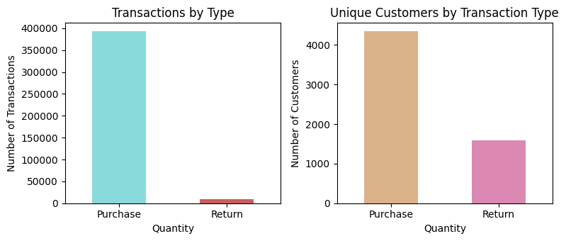
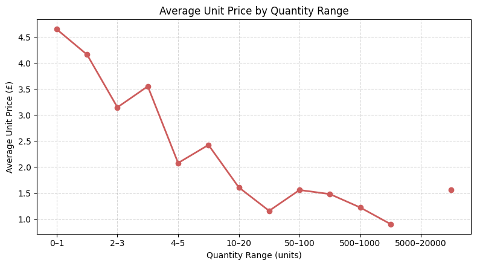
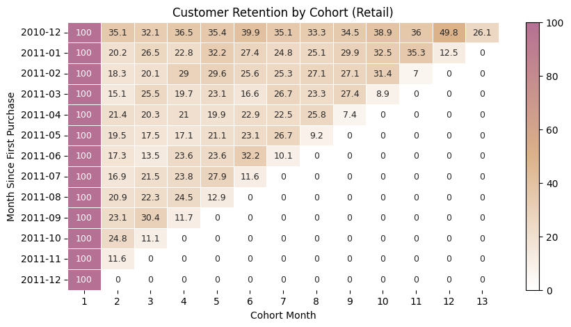

# Gift Shop Customer Behavior Analysis

## Project Overview 
### Objective
Understand customer purchasing behavior in a gift shop by:
- Identifying product co-purchases and communities.
- Predicting repeat purchases with machine learning.

Insights help inform merchandising, marketing, and cross-selling strategies.
### Data
Dataset: the **Online Retail dataset** (UCI Machine Learning Repository), that contains transactional records from a UK-based online gift shop (Dec 2010 – Dec 2011).  
Key fields: **InvoiceNo**, **StockCode**, **Description**, **Quantity**, **InvoiceDate**, **UnitPrice**, **CustomerID**, **Country**.

## Tools & Technologies
- **Python** – primary programming language  
- **Pandas & NumPy** – data manipulation and feature engineering  
- **Matplotlib & Seaborn** – data and network visualization  
- **NetworkX** – product network analysis and Louvain community detection  
- **Machine Learning** – CatBoost (classification), FP-Growth (market basket analysis)

## Methodology
1. **Exploratory Data Analysis (EDA)** – purchase/return distributions, quantity vs price, retail/wholesale segmentation.  
2. **Cohort Analysis** – customer retention over time, seasonal trends.  
3. **Predictive Modeling** – CatBoost classifier for repeat purchase prediction.  
4. **Product Relationships & Communities** – FP-Growth for frequent itemsets, Louvain method for network communities, product co-purchase visualizations.

## Key Insights
### 1. Returns
   Although returns per transaction are rare (~2%), more than a third of customers (~37%) have made at least one return.
   
### 2. Retail vs Wholesale
   Retail orders are much more often; wholesale orders correspond to large-quantity purchases with volume discounts.
   
### 3. Retention
   Retention drops quickly after the first purchase; Dec 2010 cohort shows stronger repeat behavior.
   
### 4. Product Communities
   A few popular products drive most co-purchases, forming coherent communities (herb markers, hand warmers, bags).
   

## Business Recommendations
- **Customer Retention:** Focus on early engagement and seasonal campaigns.  
- **Marketing & Personalization:** Target likely repeat buyers using prediction models.  
- **Product & Merchandising:** Bundle tightly connected products; use popular items for cross-selling; recommend similar products.

## Visualizations
- Purchase and return distributions  
- Quantity vs unit price trends  
- Cohort retention curves  
- Product co-purchase networks and community graphs  
- Tables of top products by degree and strength within communities
